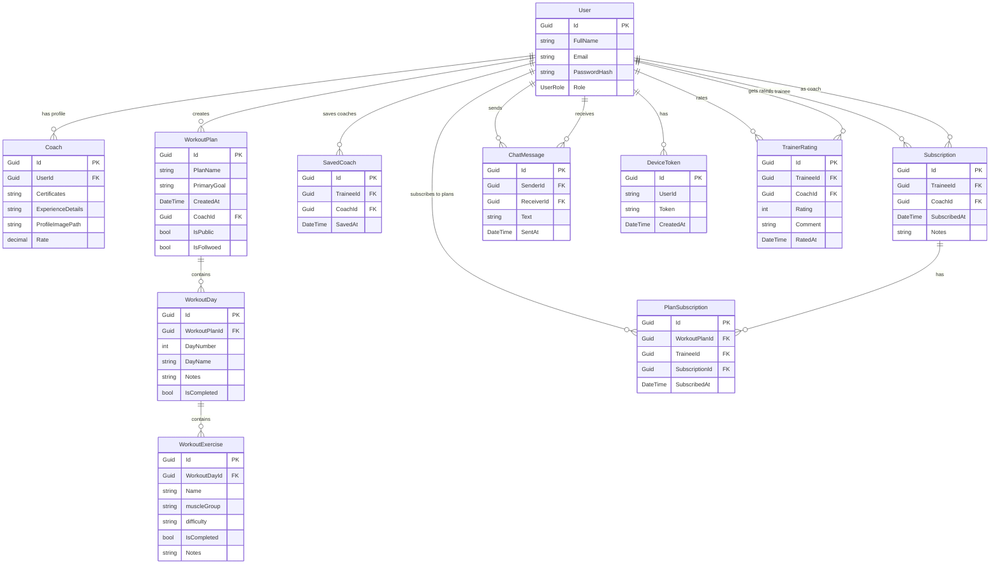

# Data Context Diagram (DCD) - 3AashYaCoach Application

## Entity Relationships Overview

## Entity Details

### 1. User
- **Primary Key:** Id (Guid)
- **Properties:**
  - FullName (string, required, max 100 chars)
  - Email (string, required, email format, max 100 chars)
  - PasswordHash (string, required)
  - Role (UserRole enum: Admin, Coach, Trainee)
- **Relationships:**
  - One-to-One with Coach (TrainerProfile)
  - One-to-Many with Subscriptions (as trainee and coach)
  - One-to-Many with SavedCoaches
  - One-to-Many with WorkoutPlans (as creator)
  - One-to-Many with PlanSubscriptions
  - One-to-Many with ChatMessages (sender/receiver)
  - One-to-Many with DeviceTokens
  - One-to-Many with TrainerRatings (rater/rated)

### 2. Coach
- **Primary Key:** Id (Guid)
- **Foreign Key:** UserId → User.Id
- **Properties:**
  - Certificates (string)
  - ExperienceDetails (string)
  - ProfileImagePath (string)
  - Rate (decimal)
- **Relationships:**
  - One-to-One with User

### 3. Subscription
- **Primary Key:** Id (Guid)
- **Foreign Keys:**
  - TraineeId → User.Id
  - CoachId → User.Id
- **Properties:**
  - SubscribedAt (DateTime, default UTC now)
  - Notes (string, max 500 chars)
- **Relationships:**
  - Many-to-One with User (Trainee)
  - Many-to-One with User (Coach)
  - One-to-Many with PlanSubscriptions

### 4. SavedCoach
- **Primary Key:** Id (Guid)
- **Foreign Keys:**
  - TraineeId → User.Id
  - CoachId → User.Id
- **Properties:**
  - SavedAt (DateTime, default UTC now)
- **Relationships:**
  - Many-to-One with User (Trainee)
  - Many-to-One with User (Coach)

### 5. WorkoutPlan
- **Primary Key:** Id (Guid)
- **Foreign Key:** CoachId → User.Id
- **Properties:**
  - PlanName (string, required)
  - PrimaryGoal (string)
  - CreatedAt (DateTime, default UTC now)
  - IsPublic (bool, default false)
  - IsFollwoed (bool, default false)
- **Relationships:**
  - Many-to-One with User (Coach)
  - One-to-Many with WorkoutDays
  - One-to-Many with PlanSubscriptions

### 6. WorkoutDay
- **Primary Key:** Id (Guid)
- **Foreign Key:** WorkoutPlanId → WorkoutPlan.Id
- **Properties:**
  - DayNumber (int, required, unique with WorkoutPlanId)
  - DayName (string)
  - Notes (string)
  - IsCompleted (bool, default false)
- **Relationships:**
  - Many-to-One with WorkoutPlan
  - One-to-Many with WorkoutExercises

### 7. WorkoutExercise
- **Primary Key:** Id (Guid)
- **Foreign Key:** WorkoutDayId → WorkoutDay.Id
- **Properties:**
  - Name (string, required)
  - muscleGroup (string)
  - difficulty (string)
  - IsCompleted (bool, default false)
  - Notes (string)
- **Relationships:**
  - Many-to-One with WorkoutDay

### 8. PlanSubscription
- **Primary Key:** Id (Guid)
- **Foreign Keys:**
  - WorkoutPlanId → WorkoutPlan.Id
  - TraineeId → User.Id
  - SubscriptionId → Subscription.Id
- **Properties:**
  - SubscribedAt (DateTime, default UTC now)
- **Relationships:**
  - Many-to-One with WorkoutPlan
  - Many-to-One with User (Trainee)
  - Many-to-One with Subscription

### 9. ChatMessage
- **Primary Key:** Id (Guid)
- **Foreign Keys:**
  - SenderId → User.Id
  - ReceiverId → User.Id
- **Properties:**
  - Text (string)
  - SentAt (DateTime)
- **Relationships:**
  - Many-to-One with User (Sender)
  - Many-to-One with User (Receiver)

### 10. DeviceToken
- **Primary Key:** Id (Guid)
- **Properties:**
  - UserId (string)
  - Token (string)
  - CreatedAt (DateTime)
- **Relationships:**
  - Many-to-One with User

### 11. TrainerRating
- **Primary Key:** Id (Guid)
- **Foreign Keys:**
  - TraineeId → User.Id
  - CoachId → User.Id
- **Properties:**
  - Rating (int)
  - Comment (string)
  - RatedAt (DateTime)
- **Relationships:**
  - Many-to-One with User (Trainee)
  - Many-to-One with User (Coach)

## Key Business Rules

1. **User Roles:** Users can be Admin, Coach, or Trainee
2. **Coach Profile:** Only users with Coach role can have a Coach profile
3. **Plan Ownership:** Only Coaches can create WorkoutPlans
4. **Subscription Flow:** Trainees must subscribe to a Coach before subscribing to their plans
5. **Day Uniqueness:** DayNumber must be unique within a WorkoutPlan
6. **Completion Tracking:** Both WorkoutDays and WorkoutExercises track completion status
7. **Chat System:** Users can send/receive messages to/from other users
8. **Rating System:** Trainees can rate Coaches
9. **Device Tokens:** Users can have multiple device tokens for notifications

## Database Constraints

- **Unique Index:** (WorkoutPlanId, DayNumber) on WorkoutDay
- **Cascade Delete:** Coach profile when User is deleted
- **Restrict Delete:** Subscription when Coach is deleted
- **Cascade Delete:** PlanSubscriptions when Subscription is deleted
- **Cascade Delete:** WorkoutDays when WorkoutPlan is deleted
- **Cascade Delete:** WorkoutExercises when WorkoutDay is deleted 